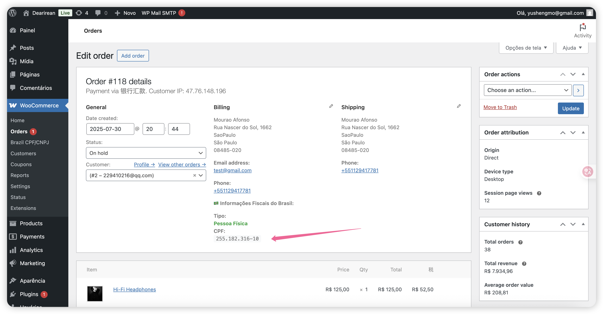

# Brazil Checkout Fields

[🇺🇸 English](README-en.md) | [🇧🇷 Português](README-pt.md) | [🇨🇳 中文](README-zh.md)

A WordPress/WooCommerce plugin for Brazilian CPF/CNPJ validation fields in checkout.

**Version:** 1.0  
**Author:** ysmo  
**License:** GPL v2 or later

---

## Description

A comprehensive WordPress/WooCommerce plugin designed specifically for Brazilian e-commerce stores. Automatically adds CPF/CNPJ validation fields to the checkout process with intelligent document type detection and real-time validation.

## Key Features

- ✅ **Smart Document Detection**: Automatically detects CPF or CNPJ based on input
- ✅ **Real-time Validation**: Instant validation using official Brazilian algorithms
- ✅ **WooCommerce Block Support**: Full compatibility with modern block-based checkout
- ✅ **HPOS Compatible**: Supports High-Performance Order Storage
- ✅ **Multi-language Support**: Available in English, Portuguese, and Chinese
- ✅ **Configurable Fields**: Customizable field names and values
- ✅ **Data Migration Tools**: Easy migration between field configurations
- ✅ **Admin Dashboard**: Statistics and management interface

## Installation

### Method 1: Git Clone (Recommended)

1. **Navigate** to your WordPress plugins directory
2. **Execute** the following command in `/wp-content/plugins`:
   ```bash
   git clone https://github.com/ysmo/brazil-checkout-fields.git
   ```
3. **Activate** the plugin in WordPress admin panel
4. **Configure** settings in WooCommerce → Brazil CPF/CNPJ

### Method 2: Manual Upload

1. **Download** the plugin files
2. **Upload** to `/wp-content/plugins/brazil-checkout-fields/`
3. **Activate** the plugin in WordPress admin panel
4. **Configure** settings in WooCommerce → Brazil CPF/CNPJ

## Configuration

### Basic Settings

Navigate to **WooCommerce → Brazil CPF/CNPJ** to configure:

- **Customer Type Field**: Database field name (default: `_brazil_customer_type`)
- **Document Field**: Field for storing CPF/CNPJ (default: `_brazil_document`)
- **CPF Value**: Value for individual customers (default: `pessoa_fisica`)
- **CNPJ Value**: Value for business customers (default: `pessoa_juridica`)

### Advanced Configuration

For developers, you can override field names using constants:

```php
// Add to your theme's functions.php
define('BRAZIL_CUSTOMER_TYPE_FIELD', '_custom_customer_type');
define('BRAZIL_DOCUMENT_FIELD', '_custom_document');
```

## Usage

1. **Customer Experience**: Users simply enter their CPF or CNPJ in a single field
2. **Automatic Detection**: Plugin detects document type automatically
3. **Real-time Validation**: Instant feedback on document validity
4. **Order Storage**: Valid documents are stored with the order

## Screenshots

### p1 - Checkout Page


_Customer checkout page showing CPF/CNPJ field with real-time validation_

### p2 - Admin Order Details


_WordPress admin showing order details with Brazilian tax information_

### p3 - Configuration Page


_Plugin settings page for configuring field names and values_

## Language Support

The plugin automatically adapts to your WordPress language setting:

- **English** (en_US) - Default
- **Portuguese** (pt_BR) - Brazilian Portuguese
- **Chinese** (zh_CN) - Simplified Chinese

To change language: **Settings → General → Site Language**

## Requirements

- WordPress 5.0+
- WooCommerce 6.0+
- PHP 7.4+

## Technical Documentation

### Database Schema

```php
// Order meta fields
meta_key: '_brazil_customer_type'  // 'pessoa_fisica' | 'pessoa_juridica'
meta_key: '_brazil_document'       // 'Formatted CPF/CNPJ'
```

### API Integration

```php
// Get customer data
$customer_type = get_post_meta($order_id, '_brazil_customer_type', true);
$document = get_post_meta($order_id, '_brazil_document', true);

// Validation functions
$is_valid_cpf = validate_cpf($document);
$is_valid_cnpj = validate_cnpj($document);
```

### Hooks & Filters

```php
// Customize field names
add_filter('brazil_checkout_field_names', function($fields) {
    return $fields;
});

// Custom validation
add_filter('brazil_document_validation', function($is_valid, $document) {
    return $is_valid;
}, 10, 2);
```

### Migration Tools

Access the migration interface at:
**WooCommerce → Brazil CPF/CNPJ → Migration Tools**

Available migrations:

- Field name changes
- Customer type value updates
- Bulk data processing

## Support

### Troubleshooting

**Problem**: Fields not showing  
**Solution**: Check if theme is compatible with WooCommerce

**Problem**: Validation not working  
**Solution**: Clear browser cache

### Debug Mode

Add `?debug=1` to the admin page URL to enable debug information.

### Version History

#### Version 1.0

- ✅ Initial release
- ✅ CPF/CNPJ validation
- ✅ Multi-language support
- ✅ WooCommerce Block compatibility
- ✅ HPOS support
- ✅ Admin interface
- ✅ Migration tools

## License

This plugin is licensed under GPL v2 or later.

## Credits

**Author**: ysmo  
**Version**: 1.0  
**Last Updated**: January 2025

Developed for the Brazilian WordPress/WooCommerce community.
