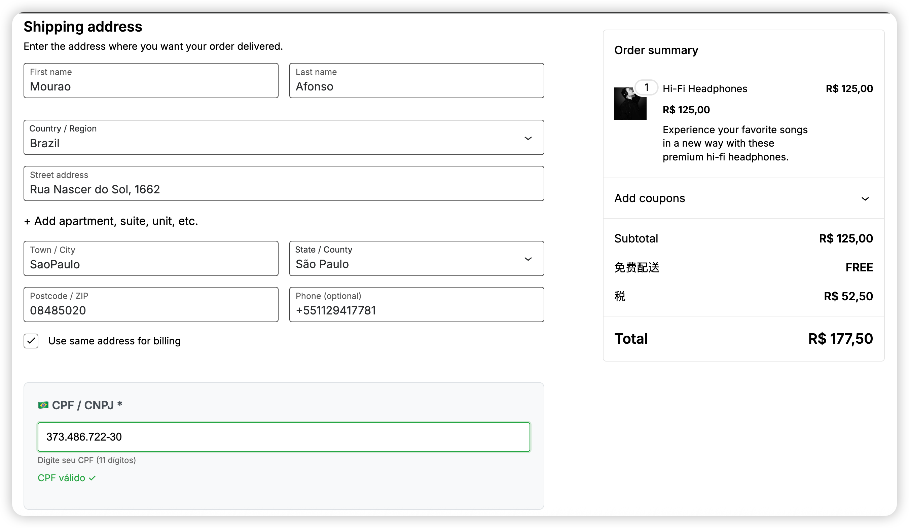
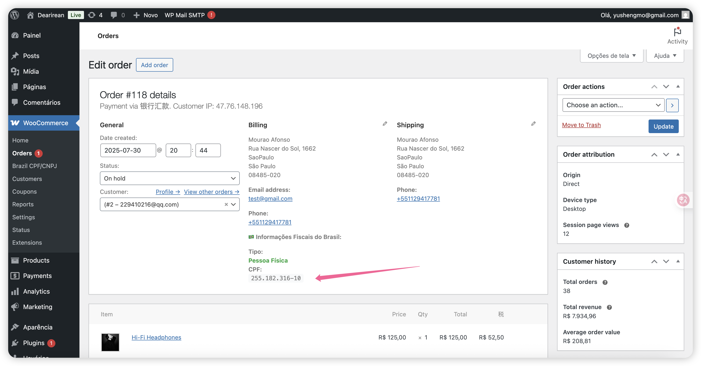
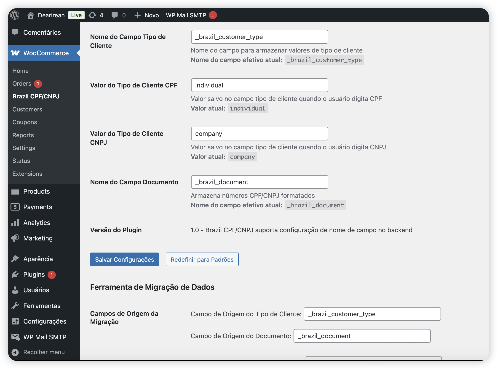

# Brazil Checkout Fields

[🇺🇸 English](#english) | [🇧🇷 Português](#português) | [🇨🇳 中文](#中文)

Um plugin WordPress/WooCommerce para validação de CPF/CNPJ em campos de checkout brasileiros.

**Versão:** 1.0  
**Autor:** ysmo  
**Licença:** GPL v2 ou posterior

---

## English

### Description

A comprehensive WordPress/WooCommerce plugin designed specifically for Brazilian e-commerce stores. Automatically adds CPF/CNPJ validation fields to the checkout process with intelligent document type detection and real-time validation.

### Key Features

- ✅ **Smart Document Detection**: Automatically detects CPF or CNPJ based on input
- ✅ **Real-time Validation**: Instant validation using official Brazilian algorithms
- ✅ **WooCommerce Block Support**: Full compatibility with modern block-based checkout
- ✅ **HPOS Compatible**: Supports High-Performance Order Storage
- ✅ **Multi-language Support**: Available in English, Portuguese, and Chinese
- ✅ **Configurable Fields**: Customizable field names and values
- ✅ **Data Migration Tools**: Easy migration between field configurations
- ✅ **Admin Dashboard**: Statistics and management interface

### Installation

#### Method 1: Git Clone (Recommended)

1. **Navigate** to your WordPress plugins directory
2. **Execute** the following command in `/wp-content/plugins`:
   ```bash
   git clone https://github.com/ysmo/brazil-checkout-fields.git
   ```
3. **Activate** the plugin in WordPress admin panel
4. **Configure** settings in WooCommerce → Brazil CPF/CNPJ

#### Method 2: Manual Upload

1. **Download** the plugin files
2. **Upload** to `/wp-content/plugins/brazil-checkout-fields/`
3. **Activate** the plugin in WordPress admin panel
4. **Configure** settings in WooCommerce → Brazil CPF/CNPJ

### Configuration

#### Basic Settings

Navigate to **WooCommerce → Brazil CPF/CNPJ** to configure:

- **Customer Type Field**: Database field name (default: `_brazil_customer_type`)
- **Document Field**: Field for storing CPF/CNPJ (default: `_brazil_document`)
- **CPF Value**: Value for individual customers (default: `pessoa_fisica`)
- **CNPJ Value**: Value for business customers (default: `pessoa_juridica`)

#### Advanced Configuration

For developers, you can override field names using constants:

```php
// Add to your theme's functions.php
define('BRAZIL_CUSTOMER_TYPE_FIELD', '_custom_customer_type');
define('BRAZIL_DOCUMENT_FIELD', '_custom_document');
```

### Usage

1. **Customer Experience**: Users simply enter their CPF or CNPJ in a single field
2. **Automatic Detection**: Plugin detects document type automatically
3. **Real-time Validation**: Instant feedback on document validity
4. **Order Storage**: Valid documents are stored with the order

### Screenshots

#### p1 - Checkout Page


_Customer checkout page showing CPF/CNPJ field with real-time validation_

#### p2 - Admin Order Details


_WordPress admin showing order details with Brazilian tax information_

#### p3 - Configuration Page


_Plugin settings page for configuring field names and values_

### Language Support

The plugin automatically adapts to your WordPress language setting:

- **English** (en_US) - Default
- **Portuguese** (pt_BR) - Brazilian Portuguese
- **Chinese** (zh_CN) - Simplified Chinese

To change language: **Settings → General → Site Language**

### Requirements

- WordPress 5.0+
- WooCommerce 6.0+
- PHP 7.4+

---

## Português

### Descrição

Plugin WordPress/WooCommerce desenvolvido especificamente para lojas brasileiras. Adiciona automaticamente campos de validação CPF/CNPJ ao processo de checkout com detecção inteligente do tipo de documento e validação em tempo real.

### Recursos Principais

- ✅ **Detecção Inteligente**: Detecta automaticamente CPF ou CNPJ baseado na entrada
- ✅ **Validação em Tempo Real**: Validação instantânea usando algoritmos oficiais brasileiros
- ✅ **Suporte a Blocos**: Compatibilidade total com checkout baseado em blocos
- ✅ **Compatível com HPOS**: Suporta Armazenamento de Pedidos de Alta Performance
- ✅ **Suporte Multi-idioma**: Disponível em inglês, português e chinês
- ✅ **Campos Configuráveis**: Nomes de campos e valores personalizáveis
- ✅ **Ferramentas de Migração**: Migração fácil entre configurações de campos
- ✅ **Painel Administrativo**: Interface de estatísticas e gerenciamento

### Instalação

#### Método 1: Git Clone (Recomendado)

1. **Navegue** até o diretório de plugins do WordPress
2. **Execute** o seguinte comando em `/wp-content/plugins`:
   ```bash
   git clone https://github.com/ysmo/brazil-checkout-fields.git
   ```
3. **Ative** o plugin no painel administrativo do WordPress
4. **Configure** as opções em WooCommerce → Brazil CPF/CNPJ

#### Método 2: Upload Manual

1. **Baixe** os arquivos do plugin
2. **Faça upload** para `/wp-content/plugins/brazil-checkout-fields/`
3. **Ative** o plugin no painel administrativo do WordPress
4. **Configure** as opções em WooCommerce → Brazil CPF/CNPJ

### Configuração

#### Configurações Básicas

Navegue até **WooCommerce → Brazil CPF/CNPJ** para configurar:

- **Campo Tipo de Cliente**: Nome do campo no banco (padrão: `_brazil_customer_type`)
- **Campo Documento**: Campo para armazenar CPF/CNPJ (padrão: `_brazil_document`)
- **Valor CPF**: Valor para clientes pessoa física (padrão: `pessoa_fisica`)
- **Valor CNPJ**: Valor para clientes pessoa jurídica (padrão: `pessoa_juridica`)

#### Configuração Avançada

Para desenvolvedores, você pode sobrescrever nomes de campos usando constantes:

```php
// Adicione ao functions.php do seu tema
define('BRAZIL_CUSTOMER_TYPE_FIELD', '_tipo_cliente_customizado');
define('BRAZIL_DOCUMENT_FIELD', '_documento_customizado');
```

### Como Usar

1. **Experiência do Cliente**: Usuários simplesmente inserem seu CPF ou CNPJ em um único campo
2. **Detecção Automática**: Plugin detecta o tipo de documento automaticamente
3. **Validação em Tempo Real**: Feedback instantâneo sobre a validade do documento
4. **Armazenamento**: Documentos válidos são armazenados com o pedido

### Capturas de Tela

#### p1 - Página de Checkout


_Página de checkout do cliente mostrando campo CPF/CNPJ com validação em tempo real_

#### p2 - Detalhes do Pedido no Admin


_Painel administrativo WordPress mostrando detalhes do pedido com informações fiscais brasileiras_

#### p3 - Página de Configuração


_Página de configurações do plugin para configurar nomes de campos e valores_

### Suporte de Idiomas

O plugin se adapta automaticamente à configuração de idioma do WordPress:

- **Inglês** (en_US) - Padrão
- **Português** (pt_BR) - Português Brasileiro
- **Chinês** (zh_CN) - Chinês Simplificado

Para alterar idioma: **Configurações → Geral → Idioma do Site**

### Requisitos

- WordPress 5.0+
- WooCommerce 6.0+
- PHP 7.4+

---

## 中文

### 描述

专为巴西电子商务商店设计的 WordPress/WooCommerce 插件。自动添加 CPF/CNPJ 验证字段到结账流程，具有智能文档类型检测和实时验证功能。

### 主要功能

- ✅ **智能文档检测**: 根据输入自动检测 CPF 或 CNPJ
- ✅ **实时验证**: 使用巴西官方算法进行即时验证
- ✅ **区块支持**: 完全兼容现代基于区块的结账
- ✅ **HPOS 兼容**: 支持高性能订单存储
- ✅ **多语言支持**: 提供英语、葡萄牙语和中文版本
- ✅ **可配置字段**: 可自定义字段名称和值
- ✅ **数据迁移工具**: 轻松在字段配置间迁移
- ✅ **管理面板**: 统计和管理界面

### 安装方法

#### 方法 1: Git 克隆（推荐）

1. **导航** 到 WordPress 插件目录
2. **在** `/wp-content/plugins` **执行**以下命令：
   ```bash
   git clone https://github.com/ysmo/brazil-checkout-fields.git
   ```
3. **激活** 插件在 WordPress 管理面板中
4. **配置** 设置在 WooCommerce → Brazil CPF/CNPJ

#### 方法 2: 手动上传

1. **下载** 插件文件
2. **上传** 到 `/wp-content/plugins/brazil-checkout-fields/`
3. **激活** 插件在 WordPress 管理面板中
4. **配置** 设置在 WooCommerce → Brazil CPF/CNPJ

### 配置说明

#### 基础设置

导航到 **WooCommerce → Brazil CPF/CNPJ** 进行配置：

- **客户类型字段**: 数据库字段名称（默认：`_brazil_customer_type`）
- **文档字段**: 存储 CPF/CNPJ 的字段（默认：`_brazil_document`）
- **CPF 值**: 个人客户的值（默认：`pessoa_fisica`）
- **CNPJ 值**: 企业客户的值（默认：`pessoa_juridica`）

#### 高级配置

对于开发者，可以使用常量覆盖字段名称：

```php
// 添加到主题的 functions.php
define('BRAZIL_CUSTOMER_TYPE_FIELD', '_自定义客户类型');
define('BRAZIL_DOCUMENT_FIELD', '_自定义文档');
```

### 使用方法

1. **客户体验**: 用户只需在单个字段中输入 CPF 或 CNPJ
2. **自动检测**: 插件自动检测文档类型
3. **实时验证**: 文档有效性的即时反馈
4. **订单存储**: 有效文档与订单一起存储

### 截图展示

#### p1 - 结账页面


_客户结账页面显示具有实时验证的 CPF/CNPJ 字段_

#### p2 - 管理后台订单详情


_WordPress 管理后台显示带有巴西税务信息的订单详情_

#### p3 - 配置页面


_插件设置页面，用于配置字段名称和值_

### 语言支持

插件自动适应您的 WordPress 语言设置：

- **英语** (en_US) - 默认
- **葡萄牙语** (pt_BR) - 巴西葡萄牙语
- **中文** (zh_CN) - 简体中文

更改语言：**设置 → 常规 → 站点语言**

### 系统要求

- WordPress 5.0+
- WooCommerce 6.0+
- PHP 7.4+

---

## Technical Documentation / Documentação Técnica / 技术文档

### Database Schema / Esquema do Banco / 数据库架构

```php
// Order meta fields / Campos meta do pedido / 订单元字段
meta_key: '_brazil_customer_type'  // 'pessoa_fisica' | 'pessoa_juridica'
meta_key: '_brazil_document'       // 'Formatted CPF/CNPJ'
```

### API Integration / Integração API / API 集成

```php
// Get customer data / Obter dados do cliente / 获取客户数据
$customer_type = get_post_meta($order_id, '_brazil_customer_type', true);
$document = get_post_meta($order_id, '_brazil_document', true);

// Validation functions / Funções de validação / 验证函数
$is_valid_cpf = validate_cpf($document);
$is_valid_cnpj = validate_cnpj($document);
```

### Hooks & Filters / Ganchos e Filtros / 钩子和过滤器

```php
// Customize field names / Personalizar nomes de campos / 自定义字段名称
add_filter('brazil_checkout_field_names', function($fields) {
    return $fields;
});

// Custom validation / Validação personalizada / 自定义验证
add_filter('brazil_document_validation', function($is_valid, $document) {
    return $is_valid;
}, 10, 2);
```

### Migration Tools / Ferramentas de Migração / 迁移工具

Access the migration interface at:
**WooCommerce → Brazil CPF/CNPJ → Migration Tools**

Available migrations:

- Field name changes
- Customer type value updates
- Bulk data processing

---

## Support / Suporte / 支持

### Troubleshooting / Solução de Problemas / 故障排除

**Problem**: Fields not showing  
**Solução**: Verifique se o tema é compatível com WooCommerce  
**解决方案**: 检查主题是否与 WooCommerce 兼容

**Problem**: Validation not working  
**Solução**: Limpe o cache do navegador  
**解决方案**: 清除浏览器缓存

### Debug Mode / Modo Debug / 调试模式

Add `?debug=1` to the admin page URL to enable debug information.

### Version History / Histórico de Versões / 版本历史

#### Version 1.0

- ✅ Initial release / Lançamento inicial / 初始版本
- ✅ CPF/CNPJ validation / Validação CPF/CNPJ / CPF/CNPJ 验证
- ✅ Multi-language support / Suporte multi-idioma / 多语言支持
- ✅ WooCommerce Block compatibility / Compatibilidade com Blocos / 区块兼容性
- ✅ HPOS support / Suporte HPOS / HPOS 支持
- ✅ Admin interface / Interface administrativa / 管理界面
- ✅ Migration tools / Ferramentas de migração / 迁移工具

---

## License / Licença / 许可证

This plugin is licensed under GPL v2 or later.  
Este plugin está licenciado sob GPL v2 ou posterior.  
此插件采用 GPL v2 或更高版本许可证。

## Credits / Créditos / 致谢

**Author / Autor / 作者**: ysmo  
**Version / Versão / 版本**: 1.0  
**Last Updated / Última Atualização / 最后更新**: January 2025

Developed for the Brazilian WordPress/WooCommerce community.  
Desenvolvido para a comunidade brasileira WordPress/WooCommerce.  
为巴西 WordPress/WooCommerce 社区开发。
